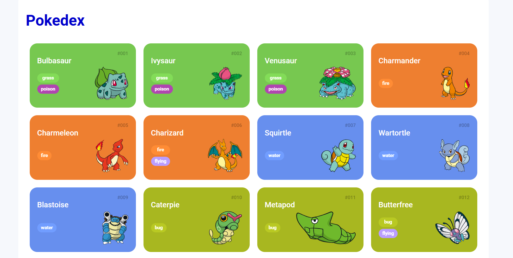

# Pokédex

Uma Pokédex simples feita com HTML, CSS e JavaScript que consome dados da [PokéAPI](https://pokeapi.co/).



## 🔍 Sobre o Projeto

Este projeto tem como objetivo praticar e demonstrar o uso de:

- Requisições `fetch()` à uma API pública
- Manipulação da DOM com JavaScript puro
- Organização de estilos com CSS responsivo
- Estruturação semântica com HTML

## ⚙️ Funcionalidades

- Listagem dos primeiros 151 Pokémons (Geração I)
- Exibição de nome, número, tipos e imagem de cada Pokémon
- Cores dos tipos personalizadas
- Paginação com botão "Carregar mais"

## 🧪 Tecnologias Utilizadas

- HTML5
- CSS3 (Grid Layout e Responsividade)
- JavaScript ES6+
- PokéAPI

## 📁 Estrutura do Projeto

```plaintext
pokedex/
│
├── assets/
│   └── css/
│       ├── global.css
│       └── pokedex.css
│
├── js/
│   ├── main.js
│   ├── poke-api.js
│   └── pokemon-model.js
│
├── index.html
└── README.md

## 🧠 Como funciona

- O script `main.js` busca os Pokémons por página usando a PokéAPI.
- Os dados são processados no `poke-api.js`, convertendo os detalhes da API para objetos mais simples.
- A imagem de cada Pokémon é exibida usando a versão `official-artwork`, com fallback em caso de falha.
- Cada tipo de Pokémon possui uma cor específica no CSS (`pokedex.css`).

## ✅ Como usar

1. Clone este repositório:
   ```bash
   git clone https://github.com/seu-usuario/pokedex.git

## 🚀 Como usar

2. Abra o arquivo `index.html` em seu navegador.

    Nenhum servidor é necessário — é um projeto 100% front-end!

---

## 📌 Requisitos

- Navegador moderno (Chrome, Firefox, Edge, etc).
- Conexão com a internet (para consumir a PokéAPI).

---

## ✨ Possíveis melhorias futuras

- Campo de busca por nome ou número.
- Filtro por tipo.
- Detalhes ao clicar em um Pokémon.
- Scroll infinito ao invés de botão.

---

## 🧑‍💻 Autor

Desenvolvido por **[Christiane Rodrigues - CRA]**  
Feito com ❤️ utilizando **JavaScript puro** e a [PokéAPI](https://pokeapi.co/).
